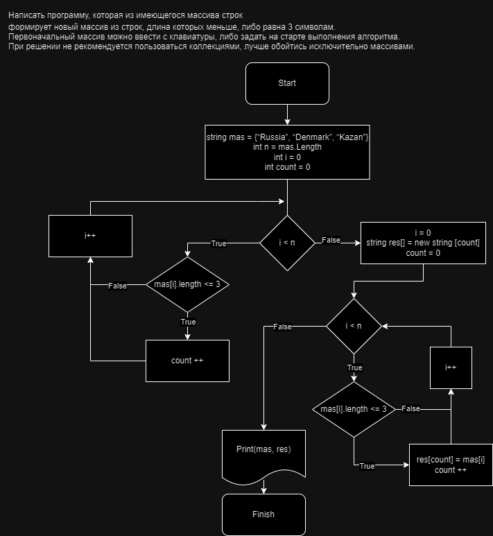

# Итоговая контрольная работа по основному блоку

## 1. Создать репозиторий на GitHub
[Ссылка](https://github.com/shlomeno4ek/GeekBrainsFinalTaskPath1.git) на репозиторий
## 2. Нарисовать блок-схему алгоритма (можно обойтись блок-схемой основной содержательной части, если вы выделяете её в отдельный метод)
[Блок-схема](https://drive.google.com/file/d/1gItyc0J8c9klIHBoxdJ6qzJ-jBz9Y2a3/view?usp=sharing)



## 3. Снабдить репозиторий оформленным текстовым описанием решения (файл README.md)
Данный файл
## 4. Написать программу, решающую поставленную задачу
Ниже представлен основной метод программы, который создает новый массив с элементами длинной <= 3 символов.
```C#
string[] CreateNewMas(string[] data)
{
    string[] temp = new string[CountElements(data)];
    int j = 0;
    for (int i = 0; i < data.Length; i++)// перебираем каждый элемент массива
    {
        if (data[i].Length <= 3) //Проверяем длинну строки
        {
            temp[j] = data[i];
            j ++;
        }
    }
    return temp;
}
```
## 5. Использовать контроль версий в работе над этим небольшим проектом (не должно быть так, что всё залито одним коммитом, как минимум этапы 2, 3, и 4 должны быть расположены в разных коммитах)
```
fa69170 (HEAD -> main, origin/main, origin/HEAD) Add function string[] CreateNewMas(string[] data) for create a new array with elements that are less than 3 in length
4e3e356 Add function void PrintMas(string[] mas) for printing massive
12a58b0 Add function int CountElements(string[] data) for counting elements
592e281 add new app
8459769 delete app
d9ef947 eddit  file .gitignore
9900563 Create new app and add file .gitignore
4c36d60 Delete удалил лишний файл
6271a8e Добил описание в файл README
32cf2d1 Create READMI.m
```
## Задача :
Написать программу, которая из имеющегося массива строк формирует массив из строк, длина которых меньше либо равна 3 символа. Первоначальный массив можно ввести с клавиатуры, либо задать на старте выполнения алгоритма. При решение не рекомендуется пользоваться коллекциями, лучше обойтись исключительно массивами

### Алгоритм решения данной задачи:
1. В начале нужно посчитать сколько элементов в исходном массиве имеют длинну <= 3. ***Для этого создал метод `int CountElements(string[] data)`***
2. Во втором методе `string[] CreateNewMas(string[] data)` создаем временный массив нужного размера, заполняем и возвращаем нужный массив.
3. Метод `void PrintMas(string[] mas)` выводит передаваемый массив на экран.
